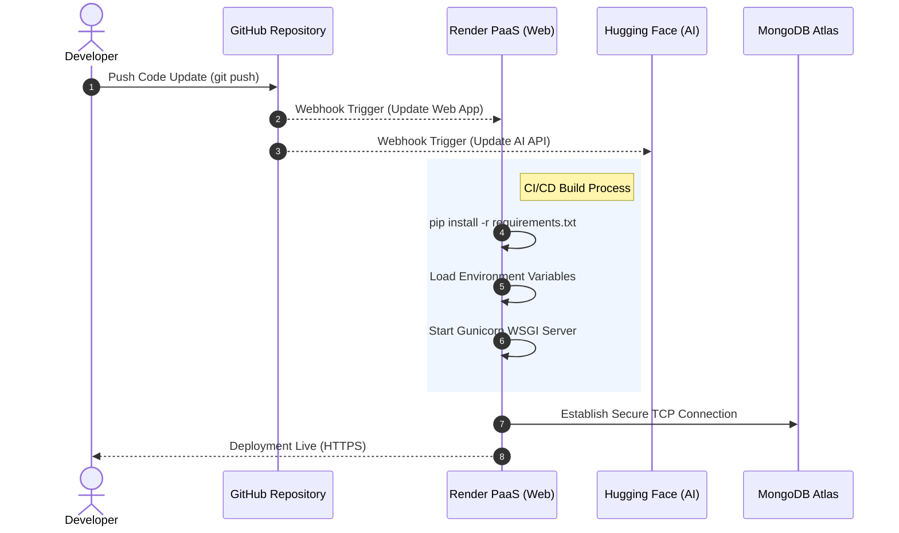

# 🚀 HRVision: AI-Powered Recruitment Ecosystem

**HRVision** is a next-generation Applicant Tracking System (ATS) developed as a Final Year Project. By leveraging Deep Learning and Natural Language Processing (NLP), HRVision eliminates the "black box" of AI hiring, providing transparent, explainable semantic scoring to identify the best talent while offering candidates a frictionless, "apply-once" experience.

---

# 🛠️ Technology Stack

| Layer | Technology |
| :--- | :--- |
| **Backend** | Python 3.x, Flask |
| **Database** | MongoDB Atlas (NoSQL) |
| **AI/NLP Engine** | `sentence-transformers`, PyTorch, Hugging Face Hub |
| **File Processing** | `PyPDF2`, `python-docx`, `Mammoth.js` |
| **Frontend** | HTML5, CSS3, JavaScript (Vanilla), Chart.js, DataTables |

---

# ⚙️ Core Architecture & Cloud Integration

## 1. The Distributed Infrastructure

HRVision utilizes a **Distributed Microservices Architecture** to ensure high performance, modularity, and scalability.

### 🔹 Web Server (Render)
The Flask-based backend application is hosted on Render.  
It manages:

- User authentication
- Routing and API handling
- Resume upload management
- File parsing
- Environment variable detection at runtime

### 🔹 AI Microservice (Hugging Face Spaces)
The NLP-intensive processing is offloaded to a dedicated AI API hosted on Hugging Face Spaces.

The workflow includes:

1. Render sends lightweight JSON payloads
2. Hugging Face performs tensor computations
3. Semantic scoring results are returned to the Flask server

This architecture significantly reduces server load and improves scalability.

### 🔹 Database Layer (MongoDB Atlas)
MongoDB Atlas provides secure cloud-based persistent storage for:

- Candidate profiles
- Job postings
- Recruitment analytics
- Resume metadata

All communication occurs over secure TLS/SSL connections.

---

# 🧠 AI Scoring Pipeline

HRVision follows a transparent semantic-matching pipeline instead of using opaque keyword filtering systems.

## Step 1 — Resume Text Extraction
Uploaded files are parsed using:

- `PyPDF2` for PDF files
- `python-docx` for DOCX documents

The extracted content is normalized into raw textual data.

---

## Step 2 — Embedding Generation

The extracted resume text and job descriptions are converted into numerical vector embeddings using the transformer model:

```python
all-MiniLM-L6-v2
```

This model captures semantic meaning rather than simple keyword overlap.

---

## Step 3 — Semantic Similarity Scoring

The system calculates **Cosine Similarity** between:

- Candidate embedding vector
- Job requirement embedding vector

Higher similarity values indicate stronger semantic alignment between the applicant and the job requirements.

The final score is then displayed with explainable ranking metrics.

---

# 🚀 Deployment Pipeline (CI/CD)

The deployment pipeline is fully automated using GitHub webhooks and cloud integration.



---

# 📦 Setup & Installation

## 1. Environment Requirements

Before running HRVision locally, ensure the following are installed:

- Python 3.x
- MongoDB Atlas Cluster
- Render Account (for deployment)

---

## 2. Environment Configuration (`.env`)

Create a `.env` file in the project root directory:

```env
FLASK_SECRET_KEY=your_secure_random_key
MONGO_URI=mongodb+srv://<username>:<password>@cluster.mongodb.net/hrvision_db
MAIL_USERNAME=your_email@gmail.com
MAIL_PASSWORD=your_16_digit_app_password
RENDER=false
```

---

## 3. Install Dependencies

Install all required production dependencies:

```bash
pip install flask pymongo sentence-transformers torch PyPDF2 python-docx python-dotenv requests
```

---

# 🔒 Security Features

HRVision follows modern deployment security practices:

- Sensitive credentials are stored using environment variables
- Database communication is encrypted with TLS/SSL
- MongoDB Atlas access is restricted through IP whitelisting
- AI processing is isolated in a separate microservice layer
- No sensitive keys are exposed in the public repository

---

# 📊 Deployment Notes for FYP Defense

## 🔹 SMTP Restrictions on Render

If email functionality fails during demonstration:

> Free-tier PaaS providers often block outbound SMTP ports (25/587) to prevent spam and abuse.

In a production-grade environment, transactional email services such as:

- SendGrid
- Mailgun
- AWS SES

would be integrated instead.

---

## 🔹 Why Render Instead of Vercel?

Render was selected because:

| Vercel Limitation | Impact |
|---|---|
| 250MB serverless deployment limit | Incompatible with AI/NLP dependencies |
| Read-only file system | Restricts resume uploads and temporary processing |
| Cold-start latency | Affects NLP inference performance |

Render provides a more suitable environment for:

- Flask applications
- File uploads
- Persistent AI integrations
- Long-running backend services

---

## 🔹 Explainable AI Advantage

Unlike traditional ATS systems that rely purely on keyword matching, HRVision provides:

- Semantic understanding
- Transparent scoring
- Explainable ranking logic
- Fairer candidate evaluation

This improves trust for both recruiters and applicants.

---

# ✅ Key Features Summary

- AI-powered semantic resume screening
- Explainable candidate scoring
- Distributed cloud microservices architecture
- Resume parsing for PDF/DOCX files
- Secure MongoDB Atlas integration
- Automated CI/CD deployment pipeline
- Scalable NLP inference via Hugging Face
- Modern recruiter dashboard experience

---

# 👨‍💻 Project Objective

The primary goal of HRVision is to modernize recruitment workflows by combining:

- Artificial Intelligence
- NLP-based semantic understanding
- Cloud-native deployment
- Explainable recommendation systems

The platform reduces manual recruiter workload while improving candidate-job matching accuracy.

---